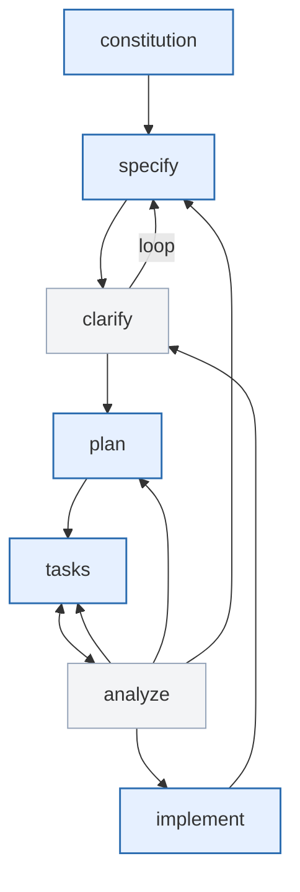

## 实验 1：GitHub Copilot 辅助需求分析与项目规划

**目标**：使用 Spec-Kit 和 GitHub Copilot 完成从需求说明到技术规划的全过程，为后续编码做好准备。

### 实验背景与目的

- 引入 规范**驱动开发（SDD）** 的理念，介绍 Spec-Kit 的四阶段工作流：需求规范 → 计划 → 任务 → 实现（Specify → Plan → Tasks → Implement）。
- 强调 AI 辅助下减少“意图识别走样”和“过度设计”，结构化需求分析的重要性。
- 本实验聚焦 **Specify** 与 **Plan** 阶段。


### 实验准备

- 安装并配置 Spec-Kit（本地 VS Code）。
    - 安装步骤请查询文档末尾`Spec‑Kit 环境准备与安装`模块内容
- 确保 GitHub Copilot 已启用并可在编辑器中使用。


### 实验验收标准

- spec.md 
    - 文档结构清晰、内容完整，涵盖用户场景、功能需求、关键实体与验收标准；所有需求可测试且无歧义，用户旅程描述全面。
- plan.md 
    - 文档技术栈选择明确且有依据，方案结构完整，项目目录结构清晰；性能目标与约束条件清晰，可验证。


### 实验流程


#### Step 0：选择项目

- 团队可从给出的参考项目列表中选择一个合适的项目（也可自定义项目）。
    - 参考项目请查询文档末尾`可选项目主题`模块内容
- 明确用户需求、功能范围和成功标准。

-  项目举例：
**在线计时器 / 番茄时钟应用**

    - 用户可以设置倒计时或番茄工作法时间段。
    - 时间结束时播放提示音并显示提醒。
    - 可选功能：统计每天完成的番茄数。

#### Step 1：初始化"宪章"，明确团队铁律(Constitution)
- 目的：建立团队共同遵循的项目管理原则和开发指导方针，这些原则将指导所有后续的开发工作。
    - 运行 `/constitution` 命令加载项目宪章，确保团队在同一治理基线下展开协作。
    - 命令示例：
        ```bash
        /speckit.constitution  创建专注于代码质量、测试标准、用户体验一致性和性能需求的原则
        ```

#### Step 2：创建需求规范文档(Specify)
- 目标：明确项目需求和规格
    - 这是 SDD 的灵魂环节，所有开发工作都围绕规格展开。通过结构化规范，可以让 AI 和工具自动识别、生成后续工程产物。
- 用 /specify 命令描述你要做的产品或功能，关注“做什么”和“为什么”，不涉及技术实现。

- 用 `/specify` 命令撰写需求：
    - 专注于你想构建什么和为什么构建，不涉及具体技术栈
    - 描述用户旅程和体验
    - 定义成功标准
    - 命令示例：

        ```bash
        /speckit.specify  我需要构建一个在线番茄钟应用，允许用户设置倒计时，时间结束时播放提示音
        ```

- 补充细节和场景

  - 说明用户如何使用、涉及哪些数据对象、业务约束等
    - 重点关注：
        - 业务逻辑准确性：是否符合你的业务需求
        - 功能完整性：是否遗漏重要功能
        - 边界条件：错误处理、异常情况
        - 性能要求：响应时间、并发用户数等
        - 安全要求：认证、授权、数据保护
  - 命令示例：
    ```bash
    /speckit.specify
    - 场景：启动 / 暂停 / 恢复 / 重置 / 撤销（撤销窗口 30s，最多 10 步）；离线可用（LocalStorage）。
    - 关键数据对象：userId, sessionId, timerId, startTime, duration(min), state {running, paused, stopped}, completedCount, syncStatus
    - 业务约束：时长范围 1–180 分钟；P95 UI 响应 <100ms；撤销仅回退最近操作且不影响已完成统计。
    - 异常与降级：非法输入（非数值/超范围）返回可读错误；重复启动需幂等处理；音频权限被拒绝时降级为视觉提示并记录事件。
    - 可测验收条件（示例）：Given 用户设置 25 分钟并启动，When 时间到达，Then 播放提示音或显示视觉提示且 completedCount +1；Given 音频权限拒绝，Then 显示视觉提示且不崩溃。
    ```


- 执行命令后，Github Copilot 自动生成 specs 文件夹与分支，并在新分支的指定路径创建spec.md 文件

    示例结构：

    ```bash
        specs
        └── 001-Tomato-Clock-Application
            └── spec.md
    ```

- 自动生成文档内容：
    - 用户场景和测试：基于描述生成的用户交互流程
    - 功能需求：每个需求都必须可测试和明确
    - 关键实体：如果涉及数据，识别核心数据实体
    - 验收标准：明确的成功标准和完成定义


#### Step 3：需求澄清与文档完整性检查 （Clarify，避免猜想）
- 目的：确保所有需求都明确、无歧义且可测试，是高质量工程的基础。

- 打开 `specs/xxx/spec.md`， 定位 `[NEEDS CLARIFICATION]`，逐条补充说明或与 AI 交互澄清：

- 可通过命令`/clarify`进行交互式需求澄清过程

- `/clarify`工作机制
    - 解析 /specify 输出，生成“疑问列表”：模糊术语、未量化指标、冲突需求、缺失边界。
    - 与需求方（或领域专家）进行交互式问答（可能循环多轮）。
    - 记录决策与补充说明（形成“澄清日志”）。
- 典型澄清类型：
    - 模糊指标 → 转化为量化：例如“高性能”→“P95 响应 < 300ms”。
    - 冲突：Story A 说“匿名可用”，Story B 要求“强制登录”。
    - 依赖外部系统 SLA 未说明。
    - 安全责任归属不清。
- 命令示例：

    ```bash
    /speckit.clarify 
    ```

- 手动或通过对话决策后：移除标记 / 追加“决策记录”段。

    - [ ] 所有 `[NEEDS CLARIFICATION]` 已消除或注明“待定”。
    - [ ] 每条功能需求有可测成功判据。
    - [ ] 错误情景（非法时间、重复启动）已列出。
    - [ ] 非功能：性能（UI 响应 <100ms）、可用性（支持快捷重启）已描述。
    - [ ] 未出现实现细节（框架、库名称）。

- Clarification Gate（通过标准）：
    - `[NEEDS CLARIFICATION]` 剩余数量 ≤ 2，且均标记“延迟决策 + 目标日期”。
    - 无未量化的形容词（如：快速 / 稳定 / 可靠）。
    - 每条用户故事具备可验证的验收描述（Given / When / Then 或等价格式）。
    - 非功能需求 (NFR) 均有数值或阈值（例如：P95 < 300ms；离线重试 < 3 次）。

#### Step 4：生成技术实现计划（Plan）
- 目标：制定技术实现计划
    - 读取功能规范，生成详细的技术实现计划，将业务需求转化为可执行的技术方案。
- 执行机制：
    - 读取和分析功能规范中的需求、用户故事和验收标准
    - 读取项目宪法确保架构合规性
    - 执行计划模板的9个阶段流程
    - 在specs目录生成多个设计文档
- 自动生成的文档：
    - plan.md - 详细实现计划和架构决策
    - research.md - 技术选型研究和决策依据
    - data-model.md - 完整的数据模型设计
    - contracts/ - OpenAPI规范和事件定义
    - quickstart.md - 关键验证场景和设置指南
- 用 `/plan` 命令生成详细的技术方案
    - Github Copilot会生成详细的技术计划，包括
        - 架构设计：系统整体架构
        - 技术栈选择：前后端技术栈
        - 数据库设计：数据模型和关系
        - API端点规划：RESTful API设计
        - 部署策略：部署和运维方案

    - 命令示例：

        ```bash
        /speckit.plan 使用HTML + CSS + JavaScript构建单页应用，支持浏览器LocalStorage保存数据。
        ```

- 相关其他文档生成后，可对技术文档做进一步补充：组件结构、数据流、状态图（可选）：

    - 命令示例：在plan.md文档中补充的 Mermaid 拓扑图（组件结构 + 数据流）。

        ```bash
        /speckit.plan "生成组件结构与数据流的 Mermaid 图" 
        ```
    - 示例输出
    ```mermaid
    flowchart LR
    User --> UI[Timer UI]
    UI --> Core[Countdown Core]
    Core --> Storage[(LocalStorage)]
    Core --> UI
    ```

### Step 5：Plan 自检清单
- [ ] 所有模块职责单一且名称清晰。
- [ ] 没有未引用的概念（如“服务总线”）。
- [ ] 数据流方向明确且无循环依赖。
- [ ] 复杂度来源（并行计时、暂停恢复）已标注风险级别。

### Step 6：成果产出与验收


- 以下是阶段实验的主要交付物及其验收标准：

    | 产物 | 验收标准 |
    | --- | --- |
    | `spec.md` — 完整的需求规范说明书 | 结构清晰、内容完整；无歧义且无未解决的澄清项；每条需求均可测；用户旅程描述全面且可验证。 |
    | `plan.md` — 技术实现计划书 | 基础信息齐全；技术选型与背景有明确理由；项目结构可落地且目录清晰；性能目标与约束可验证；宪章要求已覆盖，偏离项在复杂度/风险跟踪中说明。 |
    | `constitution.md` — 项目宪章 | 关键条款（如代码质量、TDD 策略、UX 一致性、性能预算、可观测性）均落实到计划中 |

---


---

---

## 实验 2：GitHub Copilot 驱动项目编码开发实践

**目标**：在已有需求规范与技术计划(`spec.md` + `plan.md`)基础上，利用 GitHub Copilot + Spec-Kit 完成任务分解与部分功能实现，并遵循 TDD(测试驱动开发) 原则。

### 实验背景与目的

- 承接实验一的成果，从 `spec.md` 和 `plan.md` 出发进行编码实践。
- 能将计划中的结构映射为可执行任务并标记并行性。
- 学习如何用 AI 工具生成测试用例，再实现代码。
- 落实 TDD 流程，保障交付质量。

### 实验准备

- 已完成实验一的 `spec.md` 和 `plan.md`。
- 确保 Spec-Kit 与 GitHub Copilot 可用。
- 仓库中已有基本项目结构。

### 实验验收标准
- 项目代码能在本地构建并运行。
- 所有已实现功能通过测试用例验证。
- 遵循 TDD 原则先写测试再写实现代码。


### 实验流程

#### Step 0：对齐治理基线

- 可再次审查 `constitution.md`文档，确认最新宪章原则，确保开发策略与治理约束保持一致。
- 若有新的工程实践约束或例外，先在宪章中记录并通过团队评审。

#### Step 1：生成任务列表（使用 `/tasks` 命令）
- 目标：将规格spec和计划plan分解为可执行任务。
- 核心作用：分析设计文档，生成按依赖关系排序的可执行任务列表，可以提高开发效率，减少遗漏和重复劳动。
- 执行机制：
    - 读取plan.md获取技术栈和库信息
    - 读取data-model.md、contracts/、research.md（如果文档存在）
    - 创建依赖排序和并行执行指导
    - 根据可用文档生成相应任务
    - 任务生成规则：

        - Setup 任务：项目初始化、依赖管理、代码规范配置；
        - Test 任务 [P]：每个 contract 一个测试，每个集成场景一个测试（可并行）；
        - Core 任务：每个实体、服务、CLI 命令、端点一个任务；
        - Integration 任务：数据库连接、中间件、日志记录；
        - Polish 任务 [P]：单元测试、性能优化、文档（可并行）。
- 用 `/tasks` 命令自动生成开发任务列表，支持并行任务标记，便于团队分工与进度管理。


    - 命令示例：

        ```bash
        /speckit.tasks 将上述规范spec和计划plan分解为可执行的开发任务列表，标出可以并行的 [P]
        ```

    - 示例输出：

        ```
        [ ] T001 Create project structure per implementation plan
        [ ] T002 Initialize [language] project with [framework] dependencies
        [ ] T003 [P] Configure linting and formatting tools
        [ ] T004 Setup database schema and migrations framework
        [ ] T005 [P] Implement authentication/authorization framework
        [ ] T006 [P] Setup API routing and middleware structure
        [ ] T007 Create base models/entities that all stories depend on
        ```


#### Step 2：人工审核并排序任务优先级

- 明确需要优先实现的核心功能（UI + 核心逻辑）。
- 标注需要配合宪章原则（如安全、隐私、可观测性）的任务并提前安排资源。

#### Step 3：运行 `/analyze`（任务健康审计）

- 目的：放在 Tasks 阶段之后，分析任务一致性和覆盖度，确保整个项目的实现质量。
    - 尽早发现未关联的任务、遗漏的非功能项、测试覆盖盲点与高风险区域，避免在实现阶段(`/implement`)浪费时间返工。
- 适用场景：
    - 在 `/tasks` 初稿完成后立刻运行；每次重排序或里程碑提交前；迭代开始/结束时。
- 示例流程：
    1. 准备：确保 `spec.md`、`plan.md` 与 `tasks.md` 已更新至最新版本。
    2. 命令示例：

        ```bash
        /speckit.analyze --spec spec.md --plan plan.md --tasks tasks.md --out coverage.json --risk risk_report.md
        ```

    3. 检查关键输出：
         - `coverage.json`：确认每个用户故事是否映射到至少一个 Plan 组件与至少一个 Task。
         - `risk_report.md`：重点看“高风险未被覆盖”与“未关联的任务”列表。
    4. 快速修复循环（示例流程）：
         - 若发现“未关联的任务”：在 `tasks.md` 中补上对应的 Story ID 或将任务标记为 Spike/Investigate，并给出负责人与截止日期。
         - 若发现 NFR 未覆盖：把监控/日志/安全任务加入 `tasks.md` 并在 `plan.md` 中补充阈值说明。
         - 若发现重复实现或冲突：合并任务或在 `tasks.md` 中加注互斥标记（例如：conflict: true）。
    5. 提交与通知：把更新后的 `tasks.md`/`plan.md` 提交并在 PR 描述中引用 `coverage.json` 与 `risk_report.md`，@相关角色（PM/QA/Architect）。

- 实验交付检查点（快速验收）：
    - 所有 Story 的映射率 ≥ 90%。
    - 没有 High Risk 项在 1 个 Sprint 内无对应任务。
    - 关键 NFR（性能/安全/监控）均有任务并包含验收阈值。

#### Step 4：代码开发 （Implement）
- 目的：基于TDD原则实现代码
    - 有了完整的规范和任务清单，接下来就是用 `/implement` 命令让 Github Copilot执行实际开发。
    - Github Copilot生成代码时遵循：
        - 必须先写测试（TDD原则）
        - 获得测试批准后再生成实现代码
        - 通过迭代测试和审查完善代码
    - 执行并交付可验证的增量编码任务，使「任务 → 代码 → 测试 → 构建/部署 → 验证 → 状态回写」形成自动化闭环。
-  /implement 命令示例：

    ```bash
    /speckit.implement 执行task.md中所有任务开发
    ```

-  对于新增任务或特定任务的命令示例：

    ```bash
    /speckit.implement 执行T010 - T015
    ```


- 典型流程：
    1. **拉取待办**：遵守 `/tasks` 中的依赖拓扑，确认被拉取任务的前置已完成。
    2. **分支管理**：创建或提示分支命名，约定格式 `feature/{task-id}`，确保追溯清晰。
    3. **代码/测试/文档同步推进**：先写测试再写实现（TDD），更新相关文档。
    4. **本地质量闸**：运行静态检查、单元测试、安全扫描。

    5. **验收验证**：使用验收脚本或自动化测试对照 `acceptance_criteria`，记录结果。
    6. **状态回写**：在工作流工具中更新任务状态（`done / blocked / needs-review`）。
    7. **增量指标**：收集覆盖率、变更行数、复杂度等指标，作为 `/analyze` 输入。

#### Step 5：成果产出
- 以下是阶段实验的主要交付物及其验收标准：
    | 产物 | 标准 |
    | ---- | ---- |
    | `tasks.md` | 任务可执行、顺序合理、并行标注清晰 |
    | 测试文件 | 包含单元 & 集成测试用例 |
    | 实现代码 | 满足所有测试、无遗漏项 |
    | 可观测性 | 关键事件 & 指标存在且可检查 |

#### Step 6：迭代改进（新增需求示例，可选）

- 本步骤目的：示例化展示当产品迭代需要“新增一个需求模块”时，如何用 SDD 四阶段循环（Specify → Plan → Tasks → Implement）安全增量推进，而不是直接写代码。

以下以新增“番茄统计与可视化模块”（展示日/周番茄完成趋势）为例。

- 新增能力概要：
    - 目标：用户可在“统计”页查看：
        - 当日已完成番茄数 / 目标数进度条
        - 最近 7 天每日完成数折线图
    - 业务价值：提升复盘效率，强化持续使用黏性。
    - 约束与非功能：
        - 统计计算需在 50ms 内完成（P95，本地数据集 < 5k 条）。
        - 允许离线；首次加载失败需降级为“无数据”占位，不阻塞主计时功能。
        - 不引入重量级图表库（<30KB gzip 额外体积预算）。

- 增量流程总览：
    1. Draft 需求补充 → 2. 更新 spec.md → 3. Clarification Gate → 4. 更新 plan（含数据模型/组件/性能）→ 5. 生成或追加 tasks → 6. /analyze 覆盖校验 → 7. TDD 实现 → 8. 回写指标与文档 → 9. 合规自检 & Merge。

---
##### 1. 新需求草拟
收集反馈，整理新需求：用户希望看到历史趋势。形成最小可行统计范围（最近 7 天 + 当日实时）。


##### 2. 更新 `spec.md`（Specify 扩展）
在 spec.md` 中追加“Feature: 番茄统计与可视化”版块：
- 用户故事（用户场景/需求）
- 验收标准（含无数据与离线降级情景）

命令示例：
```
/speckit.specify 追加一个名为“番茄统计与可视化”的功能：
- 用户故事：查看当日进度、最近7天趋势
- 约束：P95 本地统计计算 <50ms；额外静态资源 <30KB gzip
- 降级：无 session => 显示空状态 + 引导开始第一次番茄
```


##### 3. 需求澄清（clarify扩展，可选）
解析 /specify 输出，进行澄清检查：
```
/speckit.clarify 
```
处理并移除模糊标记，记录决策。
- 确保新增模块无未量化词（“快速”已改为 “P95 <50ms”）。
- 所有故事具备可测 Given/When/Then。
- 剩余 ≤2 个待定项并附目标日期（如：是否需要导出功能）。

##### 4. 更新 `plan.md`（Plan 扩展）
读取功能规范，生成详细的技术实现计划，将业务需求转化为可执行的技术方案。

- 命令示例：
```
/speckit.plan 新增模型“番茄统计与可视化”使用HTML + CSS + JavaScript实现，支持浏览器LocalStorage保存数据。
```


##### 5. 生成 / 更新 `tasks.md`
为新增模块生成独立任务并标注并行性：
- 命令示例：
```
/speckit.tasks 为新增统计模块生成任务：包含数据索引调整、聚合函数单测、折线图渲染、性能基准；标注可并行 [P]
```
示例（输出应人工审核后微调）：
```
[ ] T210 Update session model add optional tag & completedAt index
[ ] T211 [P] Write aggregation utility (7-day window + today progress) tests first
[ ] T212 Implement aggregation utility to satisfy tests
[ ] T213 [P] StatsView empty-state + loading skeleton
[ ] T214 Line chart minimal renderer (SVG) + tests (snapshot / data mapping)
[ ] T215 [P] Pie chart tag distribution + zero/one/many cases tests
[ ] T216 Wire stats module to completion events & storage
[ ] T217 Performance benchmark script (ensure P95 <50ms on 5k sessions)
[ ] T218 Observability: instrumentation & event logging
[ ] T219 Update docs: spec.md decisions + plan.md diagrams + quickstart
```

##### 6. 覆盖与风险分析（/analyze 可选）
在实施前（和实施过程中定期）验证工件间的一致性、覆盖率、质量偏差，形成“结构化健康报告”
- 命令示例：
```
/speckit.analyze --spec spec.md --plan plan.md --tasks tasks.md --out coverage.json --risk risk_report.md
```


##### 7. 实现阶段（/implement ，TDD）
执行并交付可验证的增量任务，使“任务→代码→测试→部署→验证→状态回写”自动化闭环。
- 命令示例：
```
/speckit.implement 执行T211
```

```
/speckit.implement 执行T212
```
并行任务（标记 [P]）可由不同成员/分支并行完成。

##### 8. 文档回写与更新
- 更新 `spec.md` 增补最终验收示例（含空/单数据点/大量数据）。
- 在 `plan.md` 记录任何偏离（如：决定引入 8KB 第三方微型图表库）。


---

通过以上结构化循环，新增模块的需求、设计、任务与实现保持一致，降低返工成本并提升可验证性。

---

---

---

## 两个实验之间的关联与区别
- 实验二依赖实验一，两者侧重点不同

    | 项目 | 实验一 | 实验二 |
    | --- | --- | --- |
    | 实验侧重点 | 如何让 Copilot 理解业务需求并转化为技术方案 | 如何让 Copilot 按 TDD 流程高质量产出代码 |
    | 重点阶段 | Specify + Plan | Tasks + Implement |
    | 核心产出 | 文档 (`spec.md`, `plan.md`) | 可运行代码 & 测试 |
    | AI 使用方式 | 辅助撰写需求 & 技术方案 | 辅助编写测试 & 功能实现 |


######

## 可选项目主题


- 本实验旨在让参与者体验 SDD 开发范式，，帮助开发者和团队通过“规范”驱动需求、设计、开发与协作流程；
- 为便于验收，所选项目均可用 HTML/CSS/JS 技术在前端直接运行，无需依赖复杂后端：
- 团队可从下列的列表中选择一个合适的小项目（见下方示例）。
- 明确用户使用流程、功能范围和成功标准。

1. **在线番茄钟 / 倒计时器**
    - **核心功能**：用户可设置倒计时或番茄工作法时间段；时间结束时播放提示音并显示提醒。
    - **可选功能**：统计每天完成的番茄数；支持离线使用（LocalStorage）。

---
1. **井字棋 (Tic-Tac-Toe)**
    - **核心功能**：双人对战或玩家 vs 简单电脑（随机落子）；棋盘状态更新与胜负判定。
    - **可选功能**：重置游戏按钮；本地胜场统计。

---

1. **打地鼠 (Whack-a-Mole)**
    - **核心功能**：随机位置出现地鼠，用户点击得分；倒计时结束显示总分。
    - **可选功能**：地鼠速度随时间增加；本地排行榜。

---

1. **贪吃蛇 (Snake Game)**
    - **核心功能**：键盘控制蛇移动并吃食物加长；撞墙或自己身体则结束游戏。
    - **可选功能**：增加障碍物；多速度模式。

---

1. **飞机大战小游戏（简版）**
    - **核心功能**：玩家控制飞机左右移动（键盘方向键或 A/D）；自动发射炮弹击落从屏幕顶部出现的敌机；敌机到达底部未被击落则玩家损失生命值；生命值为 0 时游戏结束。
    - **可选功能**：不同类型敌机（速度、血量不同）；背景音乐与射击音效。

---
1. **简单在线绘图板**
    - **核心功能**：用户可在浏览器画线条、矩形、圆形；支持颜色选择、撤销、清空画布。
    - **可选功能**：导出 PNG 图片；保存上次绘制内容到 LocalStorage。

---

1. **单位换算工具**
    - **核心功能**：支持长度（米 ↔ 英尺）、重量（公斤 ↔ 磅）、温度（摄氏 ↔ 华氏）等单位转换。
    - **可选功能**：最近使用记录（LocalStorage）；一键复制结果。

---

1. **颜色调色板生成器**
    - **核心功能**：用户选择基色，自动生成配色方案（如互补色、三分色）。
    - **可选功能**：一键复制颜色代码（HEX/RGB）；保存配色方案到 LocalStorage。

---

1. **简单图片滤镜应用**
    - **核心功能**：上传图片并应用基础滤镜（灰度、反转、模糊）。
    - **可选功能**：滤镜强度调节滑块；下载处理后的图片。

---

1. **简易计算器**
    - **核心功能**：支持基本四则运算（加减乘除）；连续计算与清空结果；键盘输入支持。
    - **可选功能**：历史记录保存到 LocalStorage；科学计算模式（平方根、幂运算）。

---

1. **音乐播放器（本地文件版）**
    - **核心功能**：用户选择本地音频文件播放；支持播放/暂停与进度条拖动。
    - **可选功能**：播放列表管理；音量调节与均衡器预设。

---

1. **表情包制作器**
    - **核心功能**：上传图片并添加文字（顶部/底部），生成表情包。
    - **可选功能**：下载生成的图片；保存模板到 LocalStorage。

---
---

---

# 什么是 Spec-Kit？

github/spec-kit 是由 GitHub 官方团队开发并维护的开源项目，全称为 “💫 Toolkit to help you get started with Spec-Driven Development”（帮助你开始规范驱动开发的工具包）。采用 MIT 协议，主要语言为 Python，社区活跃（约 2 万+ stars、1000+ forks）。

## 这个项目是什么？
spec-kit 是一个规范驱动开发（Spec‑Driven Development, SDD）的工具包，帮助开发者和团队通过“规范”驱动需求、设计、开发与协作流程，将需求文档、产品规范与代码实现紧密结合。

## 能带来什么价值？
- 促进规范驱动开发：减少需求与实现脱节，降低沟通成本，提高一致性。  
- 提升协作效率：让产品、设计、开发、测试在同一“源头”协作，降低误解与返工。  
- 自动化与智能化支持：集成 AI（如 Copilot），可自动生成部分规范、代码或测试用例，提升生产力。  
- 快速落地产品需求：支持 PRD、工程规范等标准化输出，快速对齐目标与执行路径。  
- 工程质量保障：规范驱动让代码、测试、文档围绕同一目标，降低质量问题风险。

## 解决什么问题？
- 需求与实现割裂：让流程围绕“规范”展开，缩短沟通链路。  
- 协作低效：减少跨角色沟通混乱。  
- 工程落地难：通过标准化工具与流程降低落地门槛。  
- 智能化不足：引入 AI 提升自动化，减少重复劳动。

## 适合哪些场景？
- 希望提高需求落地与开发效率的产品研发团队；  
- 需要标准化管理 PRD、技术规范和工程交付的团队；  
- 希望引入 AI 赋能开发流程的组织；  
- 多角色协同（开发、测试、产品）的项目。





## 流程解读
下面按命令级别说明各环节职责与互相关系，便于在 Spec‑Kit 流程中快速定位工作与产出文件。

- `/constitution`：定义团队宪章、格式与质量标准，作为决策与交付的治理基线（例如 constitution.md）。  
- `/specify`：在宪章约束下产出需求规范（spec.md），明确用户故事、验收条件与非功能需求。  
- `/clarify`：与 `/specify` 循环使用，列出澄清问题并记录决策，直至需求无歧义。  
- `/plan`：在稳定的 spec 基础上制定技术蓝图（plan.md），包括组件划分、数据流与关键设计决策。  
- `/tasks`：将 Plan 拆解为可执行任务（tasks.md），标注并行性、依赖与负责人。  
- `/analyze`：在任务阶段做健康审计，产出覆盖率与风险报告（coverage.json / risk_report.md）；可回溯到 `/tasks`、`/plan`、`/specify` 做补充或调整。  
- `/implement`：基于任务与审计结果实施增量交付（代码、测试与部署），过程中可触发 `/clarify`、`/plan`、`/tasks`、`/analyze` 的迭代循环。

简要流程方向：`/constitution` → `/specify` ⇄ `/clarify` → `/plan` → `/tasks` → `/analyze` → `/implement`（实施期间可回溯前端环节）。

### 典型协作角色映射（表格）

| 角色 | 主要职责 | 参与流程节点 |
|---|---|---|
| 产品经理 / 领域专家 | 主导业务目标、用户旅程与验收标准；回答澄清问题并确认决策 | /specify、/clarify |
| 架构师 / 资深工程师 | 技术选型、模块划分、横向影响评估；审查任务拆分与依赖 | /plan、/tasks、/analyze |
| 开发工程师 | 将 Plan 转为可执行任务并交付代码；执行 TDD 与实现 | /tasks、/implement |
| 测试 / QA | 提供可测的验收标准；消除模糊点；驱动覆盖性检查与验证 | /specify、/clarify、/analyze、/implement |
| DevOps / 平台工程 | 提供部署与观测策略；创建 CI/CD 与监控任务以支持自动化交付 | /plan、/tasks、/implement |
| 安全 / 合规 | 设定合规检查点与安全验收标准；在实现前后进行验证与审计 | /constitution、/plan、/analyze |

（建议将此表加入 `constitution.md` 作为协作约定，便于角色与责任的统一管理。）


### 典型初始化后的目录示例

```text
your-spec-kit-project/
├── .specify/                   # Spec Kit 配置目录
│   ├── memory/                 # 项目知识库
│   │   ├── constitution.md     # 项目宪法（九大架构原则）
│   │   └── constitution_update_checklist.md
│   ├── scripts/                # 自动化脚本
│   │   └── powershell/         # PowerShell 脚本版本
│   │       ├── create-new-feature.ps1
│   │       ├── setup-plan.ps1
│   │       ├── check-task-prerequisites.ps1
│   │       ├── common.ps1
│   │       ├── get-feature-paths.ps1
│   │       └── update-agent-context.ps1
│   └── templates/              # 模板文件
│       ├── spec-template.md    # 规范模板
│       ├── plan-template.md    # 计划模板
│       ├── tasks-template.md   # 任务模板
│       ├── checklist-template.md
│       └── agent-file-template.md # AI 助手配置模板
├── specs/                      # 功能规范目录（用户创建的规范）
│   └── 001-feature-name/       # 自动编号的功能目录
│       ├── spec.md             # 功能规范
│       ├── plan.md             # 实现计划
│       ├── research.md         # 技术研究
│       ├── data-model.md       # 数据模型
│       ├── contracts/          # API 契约
│       ├── quickstart.md       # 快速验证指南
│       └── tasks.md            # 任务列表
```


---

---


# 快速开始 — Spec‑Kit 环境准备与安装

下面是按步骤整理的环境准备与安装指南，包含推荐方式与备用方案，适用于 macOS / Linux / Windows。

## 一、环境要求
- Python 3.11+（建议 3.11 及以上）  
    检查版本：
    ```bash
    python3 --version
    ```
- Git（用于从仓库安装或同步）  
    检查版本：
    ```bash
    git --version
    ```
- 有可用的包管理器（pip）或可执行安装脚本的终端权限。

## 二、安装 uv（推荐工具）
uv 是 Spec‑Kit 推荐的包与工具管理器。两种安装方式：

1) 官方安装脚本（推荐）
- macOS / Linux（Bash）：
    ```bash
    curl -LsSf https://astral.sh/uv/install.sh | sh
    ```
- Windows（PowerShell）：
    ```powershell
    irm https://astral.sh/uv/install.ps1 | iex
    ```

2) 使用 pip（备用）
- 适用于已安装 Python + pip 的环境：
    ```bash
    pip install uv
    ```
注意：若系统存在多个 Python，请使用对应的 pip（例如 pip3）或在虚拟环境中安装。

## 三、安装 Spec‑Kit（三种方式）
### 方式一：全局安装（推荐，一次安装，处处可用）
```bash
uv tool install specify-cli --from git+https://github.com/github/spec-kit.git
specify init spec-kit-project
specify check
```


### 方式二：临时/即用（无需全局安装）
```bash
uvx --from git+https://github.com/github/spec-kit.git specify init spec-kit-project
```

### 方式三：直接下载/导入文件
可直接从github官方库下载模板文件
：
https://github.com/github/spec-kit/releases

## 四、创建/初始化项目示例
1) 在新目录创建项目（示例）
```bash
uvx --from git+https://github.com/github/spec-kit.git specify init my-project-name
```

2) 创建时指定 AI 助手（可选）
- 推荐：GitHub Copilot
```bash
uvx --from git+https://github.com/github/spec-kit.git specify init my-project-name --ai copilot
```
- 其他选项示例：claude、gemini、cursor
```bash
uvx --from git+https://github.com/github/spec-kit.git specify init my-project-name --ai claude
```

3) 在现有项目中初始化（当前目录）
```bash
specify init --here --ai copilot
```

初始化后进入项目目录：
```bash
cd my-project-name
specify check
```

## 五、Windows PowerShell 注意事项
- 在 PowerShell 中运行官方脚本示例：
```powershell
irm https://astral.sh/uv/install.ps1 | iex
```
- 如果使用 pip 安装，请以正确的 Python 环境（或管理员权限）运行 pip。


以上为精简、按步骤的环境与安装指南，按需复制命令执行即可。


